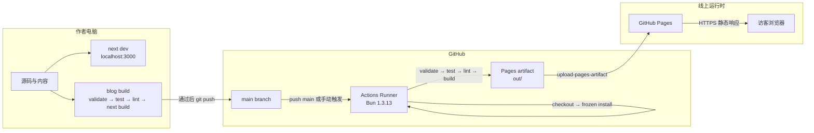

# 构建与部署图

## 目的与范围

这张图只描述时间顺序和运行环境：作者电脑、GitHub Actions Runner、GitHub Pages、访客浏览器。Next.js 在构建期运行，GitHub Pages 在运行期只提供静态文件。

## Mermaid 版本



## 纯符号版本

```text
┌──────────────────── 作者电脑 ────────────────────┐
│                                                  │
│  ┌──────────────┐      ┌──────────────────────┐  │
│  │ 源码与内容   │ ───▶ │ next dev             │  │
│  │ app/content  │      │ localhost:3000       │  │
│  └──────┬───────┘      └──────────────────────┘  │
│         │                                        │
│         ▼                                        │
│  ┌────────────────────────────────────────────┐  │
│  │ blog build                                 │  │
│  │ validate → test → lint → next build        │  │
│  └──────────────────────┬─────────────────────┘  │
└─────────────────────────┼────────────────────────┘
                          │ 通过后 git push
                          ▼
┌──────────────────────── GitHub ────────────────────────┐
│                                                        │
│  ┌──────────────┐   push main / 手动触发   ┌─────────┐ │
│  │ main branch  │ ───────────────────────▶ │ Actions │ │
│  └──────────────┘                          │ Runner  │ │
│                                            │ Bun     │ │
│                                            └────┬────┘ │
│                                                 │      │
│                                      构建通过    ▼      │
│                              ┌──────────────────────┐  │
│                              │ Pages artifact       │  │
│                              │ out/                 │  │
│                              └──────────┬───────────┘  │
└─────────────────────────────────────────┼──────────────┘
                                          │ 上传
                                          ▼
                              ┌──────────────────────────┐
                              │ GitHub Pages             │
                              │ 静态文件托管             │
                              └────────────┬─────────────┘
                                           │ HTTPS
                                           ▼
                              ┌──────────────────────────┐
                              │ 访客浏览器                 │
                              └──────────────────────────┘

失败规则：任一质量门失败 ──✕──▶ deploy
线上结果：构建失败时保留上一版已发布站点
```

## 当前 workflow 的准确顺序

根据 [`/.github/workflows/deploy.yml`](../../.github/workflows/deploy.yml)：

1. `push` 到 `main` 或 `workflow_dispatch` 触发。
2. Checkout 仓库。
3. 安装 Bun `1.3.13`。
4. 配置 GitHub Pages。
5. `bun install --frozen-lockfile`。
6. 内容校验、测试、lint、构建。
7. 上传 `./out` artifact。
8. `deploy` job 等待 `build` 成功后发布。

## 关键约束

- `next.config.ts` 的 `output: "export"` 决定构建输出为 `out/`。
- 只有静态 `GET` Route Handler 能在静态导出中生成 RSS、Sitemap 和 robots 文件。
- 动态路由必须在构建期提供 `generateStaticParams()`。
- CI 构建失败不会执行 deploy，因此线上版本保持不变。
- 标准发布不是提交 `out/`，而是提交源码和内容后让 Actions 重新生成 `out/`。

相关文档：[容器图](containers.md)、[发布操作手册](../runbooks/release.md)、[ADR-0002](../adr/0002-static-export-github-pages.md)、[ADR-0003](../adr/0003-build-validation-gates.md)。
