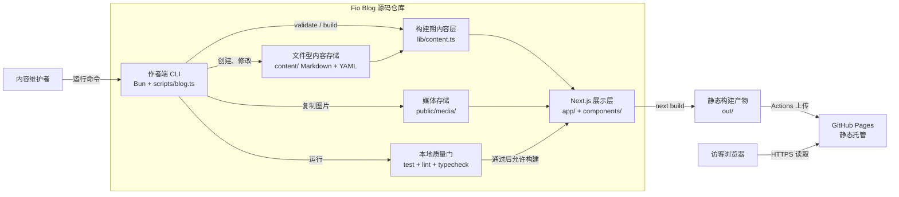

# 容器图

## 目的与范围

这张图回答：系统内部有哪些主要应用、文件存储和构建产物。这里的“容器”指一个可独立说明职责的应用或存储，不是 Docker 容器。

## Mermaid 版本



## 纯符号版本

```text
┌──────────────┐       运行命令       ┌──────────────────────────┐
│ 内容维护者   │ ───────────────────▶ │ 作者端 CLI               │
└──────────────┘                      │ Bun + scripts/blog.ts    │
                                      └───────┬──────────┬───────┘
                              创建 / 修改    │          │ 复制图片
                                             ▼          ▼
                              ┌──────────────┐  ┌────────────────┐
                              │ content/     │  │ public/media/  │
                              │ Markdown     │  │ 媒体文件       │
                              └──────┬───────┘  └───────┬────────┘
                                     │                  │
                                     └────────┬─────────┘
                                              ▼
                              ┌──────────────────────────┐
                              │ 构建期内容层              │
                              │ lib/content.ts            │
                              └──────────┬───────────────┘
                                         │ 提供已校验内容
                                         ▼
                              ┌──────────────────────────┐
                              │ Next.js 展示层             │
                              │ app/ + components/        │
                              └──────────┬───────────────┘
                                         │ next build
                         ┌───────────────▼────────────────┐
                         │ 静态构建产物 out/               │
                         │ HTML / CSS / JS / 图片 / XML   │
                         └───────────────┬────────────────┘
                                         │ Actions 上传
                                         ▼
                         ┌───────────────────────────────┐
                         │ GitHub Pages                   │
                         │ 线上只托管静态文件             │
                         └───────────────┬───────────────┘
                                         │ HTTPS
                                         ▼
                              ┌──────────────────────────┐
                              │ 访客浏览器                 │
                              └──────────────────────────┘

本地质量门：CLI ──▶ test + lint + typecheck ──▶ 允许构建
```

## 关键约束

- CLI 是作者端工具，不会部署到 GitHub Pages。
- `lib/content.ts` 在构建期读取文件，不是线上 API。
- `app/` 和 `components/` 是同一个 Next.js 展示层的两个代码区域，不是两个线上服务。
- `out/` 是可部署产物，按 [`/.gitignore`](../../.gitignore) 规则不提交到源码仓库。
- 读者浏览器只接触 GitHub Pages 上的静态文件。

## 实现依据

- CLI：[`scripts/blog.ts`](../../scripts/blog.ts)
- 内容层：[`lib/content.ts`](../../lib/content.ts)
- 展示层：[`app/`](../../app/)、[`components/`](../../components/)
- 静态导出：[`next.config.ts`](../../next.config.ts)

相关文档：[系统上下文图](system-context.md)、[内容流水线图](content-pipeline.md)、[ADR-0001](../adr/0001-cli-first-file-content.md)。
