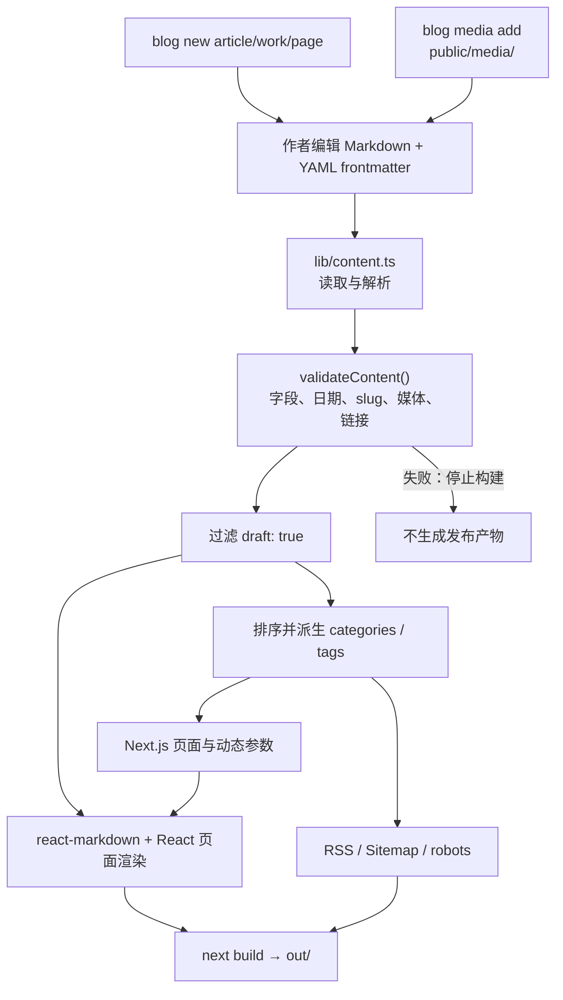

# 内容流水线图

## 目的与范围

这张图回答：一篇 Markdown 文章如何经过校验、索引和静态渲染，最终变成页面、RSS 和 Sitemap。所有步骤发生在作者电脑或 CI 构建期，不发生在线上运行时。

## Mermaid 版本



## 纯符号版本

```text
┌──────────────────────┐       ┌──────────────────────────────┐
│ blog new              │       │ blog media add              │
│ article / work / page │       │ 复制已授权媒体到 public/media │
└──────────┬───────────┘       └──────────────┬───────────────┘
           └──────────────────┬───────────────┘
                              ▼
                 ┌──────────────────────────────┐
                 │ 作者编辑 Markdown             │
                 │ YAML frontmatter + 正文       │
                 └──────────────┬───────────────┘
                                ▼
                 ┌──────────────────────────────┐
                 │ lib/content.ts                │
                 │ 读取与解析                     │
                 └──────────────┬───────────────┘
                                ▼
                 ┌──────────────────────────────┐
                 │ validateContent()             │
                 │ 字段 / 日期 / slug / 媒体 / URL │
                 └──────────────┬───────────────┘
                                │
                       失败 ────┴────▶ ✕ 停止构建
                                │通过
                                ▼
                 ┌──────────────────────────────┐
                 │ 过滤 draft: true              │
                 │ 排序、派生 categories / tags  │
                 └──────────┬───────────┬─────────┘
                            │           │
                            ▼           ▼
             ┌──────────────────┐  ┌──────────────────┐
             │ Next.js 页面参数 │  │ RSS / Sitemap    │
             │ archive / 详情页  │  │ /robots.txt      │
             └────────┬─────────┘  └────────┬─────────┘
                      └──────────┬─────────┘
                                 ▼
                 ┌──────────────────────────────┐
                 │ React + react-markdown        │
                 │ 构建期渲染                    │
                 └──────────────┬───────────────┘
                                ▼
                 ┌──────────────────────────────┐
                 │ next build                    │
                 │ out/ 静态 HTML/CSS/JS/XML      │
                 └──────────────────────────────┘
```

## 校验责任

`lib/content.ts` 负责最终内容规则；`scripts/blog.ts` 负责作者便利命令并调用校验。当前规则包括：

- 文件名为小写 kebab-case。
- 文章统一归档于 Information；News 是由公开内容更新派生的汇总流。
- 必填字符串、ISO 日期、标签和 frontmatter 字段必须合法。
- 图片只能是存在于 `public/media/` 的允许扩展名文件。
- Markdown 图片必须引用本地 `/media/` 路径。
- 非装饰媒体必须有描述性 `alt`。
- 草稿不进入公开集合、页面、RSS 和 Sitemap。

## 实现依据

- 作者命令：[`scripts/blog.ts`](../../scripts/blog.ts)
- 内容读取与校验：[`lib/content.ts`](../../lib/content.ts)
- Markdown 渲染：[`components/content-body.tsx`](../../components/content-body.tsx)
- RSS：[`app/rss.xml/route.ts`](../../app/rss.xml/route.ts)
- Sitemap：[`app/sitemap.xml/route.ts`](../../app/sitemap.xml/route.ts)

相关文档：[容器图](containers.md)、[发布操作手册](../runbooks/release.md)、[ADR-0001](../adr/0001-cli-first-file-content.md)。
