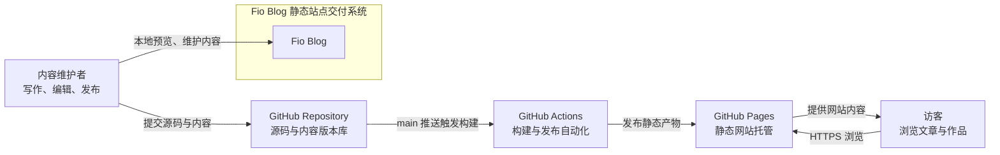

# 系统上下文图

## 目的与范围

这张图回答：谁与 Fio Blog 交互，以及外部平台如何参与交付。它不展开代码目录、函数和具体技术模块。

## Mermaid 版本



## 纯符号版本

```text
┌──────────────────────┐       提交源码与内容       ┌──────────────────────────┐
│ 内容维护者           │ ────────────────────────▶ │ GitHub Repository        │
│ 写作 / 编辑 / 发布   │                           │ 源码与内容版本库         │
└──────────┬───────────┘                           └────────────┬─────────────┘
           │ 本地预览                                          │ main 推送
           ▼                                                   ▼
┌──────────────────────┐                           ┌──────────────────────────┐
│ Fio Blog              │                           │ GitHub Actions           │
│ 静态站点交付系统      │                           │ 构建与发布自动化         │
└──────────────────────┘                           └────────────┬─────────────┘
                                                                 │ 发布静态产物
                                                                 ▼
┌──────────────────────┐       HTTPS 浏览           ┌──────────────────────────┐
│ 访客                 │ ◀──────────────────────── │ GitHub Pages             │
│ 浏览文章与作品       │       提供网站内容 ───────▶ │ 静态网站托管             │
└──────────────────────┘                           └──────────────────────────┘
```

## 关键约束

- `Fio Blog` 是交付系统的概念边界，不代表线上有一个常驻 Node.js 服务。
- 作者端和读者端是不同角色：作者修改 Git 中的内容，读者只读取已发布静态文件。
- GitHub Actions 负责构建和发布；GitHub Pages 负责托管，不负责解析 Markdown。
- 当前没有运行时 CMS、数据库、登录系统或动态 API。

## 实现依据

- 作者 CLI：[`scripts/blog.ts`](../../scripts/blog.ts)
- 内容源：[`content/`](../../content/)
- 构建配置：[`next.config.ts`](../../next.config.ts)
- CI 与 Pages：[`/.github/workflows/deploy.yml`](../../.github/workflows/deploy.yml)

相关文档：[容器图](containers.md)、[构建与部署图](build-deployment.md)、[发布操作手册](../runbooks/release.md)。
